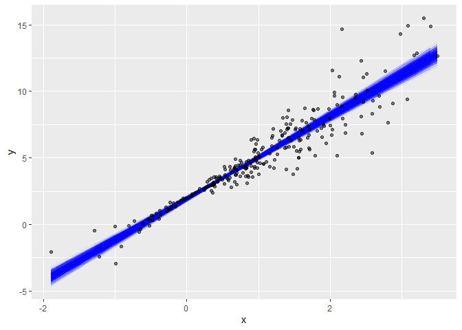

bootstrapping
================

``` r
library(tidyverse)
```

    ## ── Attaching core tidyverse packages ──────────────────────── tidyverse 2.0.0 ──
    ## ✔ dplyr     1.1.4     ✔ readr     2.1.5
    ## ✔ forcats   1.0.0     ✔ stringr   1.5.1
    ## ✔ ggplot2   3.5.2     ✔ tibble    3.3.0
    ## ✔ lubridate 1.9.4     ✔ tidyr     1.3.1
    ## ✔ purrr     1.1.0     
    ## ── Conflicts ────────────────────────────────────────── tidyverse_conflicts() ──
    ## ✖ dplyr::filter() masks stats::filter()
    ## ✖ dplyr::lag()    masks stats::lag()
    ## ℹ Use the conflicted package (<http://conflicted.r-lib.org/>) to force all conflicts to become errors

``` r
library(p8105.datasets)

set.seed(1)
```

## Simulate data

``` r
n_samp = 250

sim_df_const = 
  tibble(
    x = rnorm(n_samp, 1, 1),
    error = rnorm(n_samp, 0, 1),
    y = 2 + 3 * x + error
  )

sim_df_nonconst = sim_df_const |> 
  mutate(
  error = error * .75 * x,
  y = 2 + 3 * x + error
)
```

Plot the datasets

``` r
sim_df = 
  bind_rows(const = sim_df_const, nonconst = sim_df_nonconst, .id = "data_source") 

sim_df |> 
  ggplot(aes(x = x, y = y)) + 
  geom_point(alpha = .5) +
  stat_smooth(method = "lm") +
  facet_grid(~data_source) 
```

    ## `geom_smooth()` using formula = 'y ~ x'

<!-- -->

fitting linear regressions to both:’

``` r
lm(y ~ x, data = sim_df_const) |> 
  broom::tidy() |> 
  knitr::kable(digits = 3)
```

| term        | estimate | std.error | statistic | p.value |
|:------------|---------:|----------:|----------:|--------:|
| (Intercept) |    1.977 |     0.098 |    20.157 |       0 |
| x           |    3.045 |     0.070 |    43.537 |       0 |

now non constant

``` r
lm(y ~ x, data = sim_df_nonconst) |> 
  broom::tidy() |> 
  knitr::kable(digits = 3)
```

| term        | estimate | std.error | statistic | p.value |
|:------------|---------:|----------:|----------:|--------:|
| (Intercept) |    1.934 |     0.105 |    18.456 |       0 |
| x           |    3.112 |     0.075 |    41.661 |       0 |

Now let’s use the bootstrap to make an inference on the data

## Draw one bootstrap sample

``` r
boot_sample = function(df) {
  sample_frac(df, replace = TRUE)
}
```

we made a function so we can reuse it let’s check if it works

``` r
boot_sample(sim_df_nonconst)
```

    ## # A tibble: 250 × 3
    ##         x    error       y
    ##     <dbl>    <dbl>   <dbl>
    ##  1 -0.606 -0.106    0.0774
    ##  2 -0.524 -0.536   -0.106 
    ##  3  2.36   0.704    9.78  
    ##  4  0.785 -0.485    3.87  
    ##  5  0.557 -0.148    3.52  
    ##  6  0.164 -0.00859  2.48  
    ##  7  1.76   1.33     8.62  
    ##  8 -0.989 -1.97    -2.93  
    ##  9 -0.733  0.447    0.248 
    ## 10  0.472  0.122    3.54  
    ## # ℹ 240 more rows

``` r
boot_sample(sim_df_nonconst) |> 
  ggplot(aes(x = x, y = y)) + 
  geom_point(alpha = .5) +
  stat_smooth(method = "lm")
```

    ## `geom_smooth()` using formula = 'y ~ x'

<!-- -->

## Many samples and analysis

``` r
boot_straps = 
  tibble(strap_number = 1:1000) |> 
  mutate(
    strap_sample = map(strap_number, \(i) boot_sample(df = sim_df_nonconst))
  )

boot_straps
```

    ## # A tibble: 1,000 × 2
    ##    strap_number strap_sample      
    ##           <int> <list>            
    ##  1            1 <tibble [250 × 3]>
    ##  2            2 <tibble [250 × 3]>
    ##  3            3 <tibble [250 × 3]>
    ##  4            4 <tibble [250 × 3]>
    ##  5            5 <tibble [250 × 3]>
    ##  6            6 <tibble [250 × 3]>
    ##  7            7 <tibble [250 × 3]>
    ##  8            8 <tibble [250 × 3]>
    ##  9            9 <tibble [250 × 3]>
    ## 10           10 <tibble [250 × 3]>
    ## # ℹ 990 more rows

lets look at the first few elements

``` r
boot_straps |> 
  slice(1:3) |> 
  mutate(strap_sample = map(strap_sample, \(s) arrange(s, x))) |> 
  pull(strap_sample)
```

    ## [[1]]
    ## # A tibble: 250 × 3
    ##         x  error       y
    ##     <dbl>  <dbl>   <dbl>
    ##  1 -1.29   1.40  -0.454 
    ##  2 -0.989 -1.97  -2.93  
    ##  3 -0.914 -0.908 -1.65  
    ##  4 -0.914 -0.908 -1.65  
    ##  5 -0.805  0.292 -0.123 
    ##  6 -0.805  0.292 -0.123 
    ##  7 -0.665 -0.544 -0.539 
    ##  8 -0.641 -0.416 -0.338 
    ##  9 -0.606 -0.106  0.0774
    ## 10 -0.606 -0.106  0.0774
    ## # ℹ 240 more rows
    ## 
    ## [[2]]
    ## # A tibble: 250 × 3
    ##         x  error      y
    ##     <dbl>  <dbl>  <dbl>
    ##  1 -1.89   1.62  -2.04 
    ##  2 -1.89   1.62  -2.04 
    ##  3 -1.29   1.40  -0.454
    ##  4 -1.29   1.40  -0.454
    ##  5 -1.00   0.832 -0.169
    ##  6 -0.914 -0.908 -1.65 
    ##  7 -0.805  0.292 -0.123
    ##  8 -0.665 -0.544 -0.539
    ##  9 -0.665 -0.544 -0.539
    ## 10 -0.665 -0.544 -0.539
    ## # ℹ 240 more rows
    ## 
    ## [[3]]
    ## # A tibble: 250 × 3
    ##         x  error      y
    ##     <dbl>  <dbl>  <dbl>
    ##  1 -1.89   1.62  -2.04 
    ##  2 -1.89   1.62  -2.04 
    ##  3 -1.29   1.40  -0.454
    ##  4 -1.29   1.40  -0.454
    ##  5 -1.29   1.40  -0.454
    ##  6 -1.21  -0.781 -2.43 
    ##  7 -1.00   0.832 -0.169
    ##  8 -1.00   0.832 -0.169
    ##  9 -0.989 -1.97  -2.93 
    ## 10 -0.914 -0.908 -1.65 
    ## # ℹ 240 more rows

can I run an analysis on each of these?

``` r
bootstrap_results = 
  boot_straps |> 
  mutate(
    models = map(strap_sample, \(df) lm(y ~ x, data = df) ),
    results = map(models, broom::tidy)) |> 
  select(-strap_sample, -models) |> 
  unnest(results) 
```

what do I have now?

``` r
bootstrap_results |> 
  group_by(term) |> 
  summarize(boot_se = sd(estimate)) |> 
  knitr::kable(digits = 3)
```

| term        | boot_se |
|:------------|--------:|
| (Intercept) |   0.075 |
| x           |   0.101 |

Lets use the bootstrap estimates to construct the confidence interval

Construct bootstrap CI

``` r
bootstrap_results |> 
  group_by(term) |> 
  summarize(
    ci_lower = quantile(estimate, 0.025), 
    ci_upper = quantile(estimate, 0.975))
```

    ## # A tibble: 2 × 3
    ##   term        ci_lower ci_upper
    ##   <chr>          <dbl>    <dbl>
    ## 1 (Intercept)     1.79     2.08
    ## 2 x               2.91     3.31

``` r
boot_straps |> 
  unnest(strap_sample) |> 
  ggplot(aes(x = x, y = y)) + 
  geom_line(aes(group = strap_number), stat = "smooth", method = "lm", se = FALSE, alpha = .1, color = "blue") +
  geom_point(data = sim_df_nonconst, alpha = .5)
```

    ## `geom_smooth()` using formula = 'y ~ x'

<!-- -->

## Bootstrap using modelr

``` r
boot_straps = 
  sim_df_nonconst |> 
  modelr::bootstrap(n = 1000)

boot_straps |> pull(strap) |> nth(1)
```

    ## <resample [250 x 3]> 216, 163, 142, 68, 24, 81, 175, 115, 139, 182, ...

``` r
boot_straps |> pull(strap) |> nth(1) |> as_tibble()
```

    ## # A tibble: 250 × 3
    ##         x  error     y
    ##     <dbl>  <dbl> <dbl>
    ##  1  2.52   0.528 10.1 
    ##  2  2.06   1.74   9.91
    ##  3  2.18   1.00   9.53
    ##  4  2.47  -0.224  9.17
    ##  5 -0.989 -1.97  -2.93
    ##  6  0.431 -0.106  3.19
    ##  7  0.666  0.285  4.28
    ##  8  0.793 -0.101  4.28
    ##  9  0.348 -0.497  2.55
    ## 10  1.98   0.745  8.70
    ## # ℹ 240 more rows

repeat bootstrap analysis:

``` r
sim_df_nonconst |> 
  modelr::bootstrap(n = 1000) |> 
  mutate(
    models = map(strap, \(df) lm(y ~ x, data = df) ),
    results = map(models, broom::tidy)) |> 
  select(-strap, -models) |> 
  unnest(results) |> 
  group_by(term) |> 
  summarize(boot_se = sd(estimate))
```

    ## # A tibble: 2 × 2
    ##   term        boot_se
    ##   <chr>         <dbl>
    ## 1 (Intercept)  0.0793
    ## 2 x            0.104
