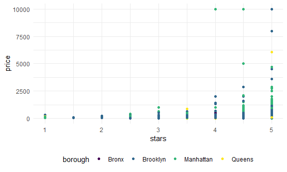
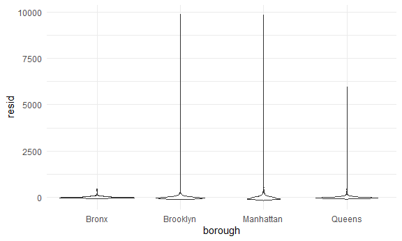
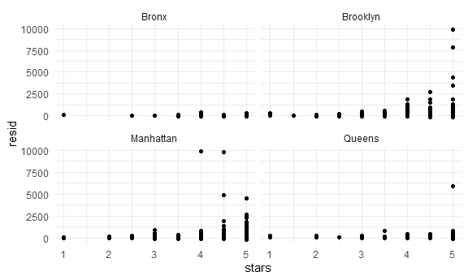
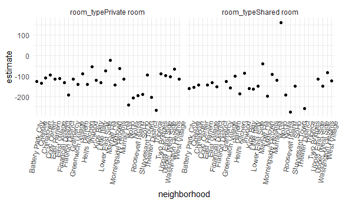

linear_models
================

``` r
library(tidyverse)
```

    ## ── Attaching core tidyverse packages ──────────────────────── tidyverse 2.0.0 ──
    ## ✔ dplyr     1.1.4     ✔ readr     2.1.5
    ## ✔ forcats   1.0.0     ✔ stringr   1.5.1
    ## ✔ ggplot2   3.5.2     ✔ tibble    3.3.0
    ## ✔ lubridate 1.9.4     ✔ tidyr     1.3.1
    ## ✔ purrr     1.1.0     
    ## ── Conflicts ────────────────────────────────────────── tidyverse_conflicts() ──
    ## ✖ dplyr::filter() masks stats::filter()
    ## ✖ dplyr::lag()    masks stats::lag()
    ## ℹ Use the conflicted package (<http://conflicted.r-lib.org/>) to force all conflicts to become errors

``` r
library(p8105.datasets)

knitr::opts_chunk$set(
  fig.width = 6,
  fig.asp = .6 ,
  out.width = "90%"
)

theme_set(theme_minimal() + theme(legend.position = "bottom"))

options(
  ggplot2.continuous.colour = "viridis",
  ggplot2.continuous.fill = "virids"
)

scale_colour_discrete = scale_color_viridis_d
scale_fill_discrete = scale_fill_viridis_d

set.seed(1)
```

``` r
data("nyc_airbnb")

nyc_airbnb = 
  nyc_airbnb |> 
  mutate(stars = review_scores_location / 2) |> 
  rename(
    borough = neighbourhood_group,
    neighborhood = neighbourhood) |> 
  filter(borough != "Staten Island") |> 
  select(price, stars, borough, neighborhood, room_type)
```

## fit a model

``` r
nyc_airbnb |> 
  ggplot(aes(x = stars, y = price, color = borough)) + geom_point()
```

    ## Warning: Removed 9962 rows containing missing values or values outside the scale range
    ## (`geom_point()`).



``` r
fit = lm(price ~ stars + borough, data = nyc_airbnb)
```

lets look at results:

``` r
fit
```

    ## 
    ## Call:
    ## lm(formula = price ~ stars + borough, data = nyc_airbnb)
    ## 
    ## Coefficients:
    ##      (Intercept)             stars   boroughBrooklyn  boroughManhattan  
    ##           -70.41             31.99             40.50             90.25  
    ##    boroughQueens  
    ##            13.21

``` r
summary(fit)
```

    ## 
    ## Call:
    ## lm(formula = price ~ stars + borough, data = nyc_airbnb)
    ## 
    ## Residuals:
    ##    Min     1Q Median     3Q    Max 
    ## -169.8  -64.0  -29.0   20.2 9870.0 
    ## 
    ## Coefficients:
    ##                  Estimate Std. Error t value Pr(>|t|)    
    ## (Intercept)       -70.414     14.021  -5.022 5.14e-07 ***
    ## stars              31.990      2.527  12.657  < 2e-16 ***
    ## boroughBrooklyn    40.500      8.559   4.732 2.23e-06 ***
    ## boroughManhattan   90.254      8.567  10.534  < 2e-16 ***
    ## boroughQueens      13.206      9.065   1.457    0.145    
    ## ---
    ## Signif. codes:  0 '***' 0.001 '**' 0.01 '*' 0.05 '.' 0.1 ' ' 1
    ## 
    ## Residual standard error: 181.5 on 30525 degrees of freedom
    ##   (9962 observations deleted due to missingness)
    ## Multiple R-squared:  0.03423,    Adjusted R-squared:  0.03411 
    ## F-statistic: 270.5 on 4 and 30525 DF,  p-value: < 2.2e-16

``` r
summary(fit)$coef
```

    ##                   Estimate Std. Error   t value     Pr(>|t|)
    ## (Intercept)      -70.41446  14.020697 -5.022180 5.137589e-07
    ## stars             31.98989   2.527500 12.656733 1.269392e-36
    ## boroughBrooklyn   40.50030   8.558724  4.732049 2.232595e-06
    ## boroughManhattan  90.25393   8.567490 10.534465 6.638618e-26
    ## boroughQueens     13.20617   9.064879  1.456850 1.451682e-01

Let’s look at the results better

``` r
fit |> 
  broom::tidy() |> 
  select(term, estimate, p.value) |> 
  mutate(term = str_replace(term, "^borough", "Borough: ")) |> 
  knitr::kable(digits = 3)
```

| term               | estimate | p.value |
|:-------------------|---------:|--------:|
| (Intercept)        |  -70.414 |   0.000 |
| stars              |   31.990 |   0.000 |
| Borough: Brooklyn  |   40.500 |   0.000 |
| Borough: Manhattan |   90.254 |   0.000 |
| Borough: Queens    |   13.206 |   0.145 |

## Be in control of factors

this was in the video but we will not do

## Diagnostics

``` r
modelr::add_residuals(nyc_airbnb, fit)
```

    ## # A tibble: 40,492 × 6
    ##    price stars borough neighborhood room_type        resid
    ##    <dbl> <dbl> <chr>   <chr>        <chr>            <dbl>
    ##  1    99   5   Bronx   City Island  Private room      9.47
    ##  2   200  NA   Bronx   City Island  Private room     NA   
    ##  3   300  NA   Bronx   City Island  Entire home/apt  NA   
    ##  4   125   5   Bronx   City Island  Entire home/apt  35.5 
    ##  5    69   5   Bronx   City Island  Private room    -20.5 
    ##  6   125   5   Bronx   City Island  Entire home/apt  35.5 
    ##  7    85   5   Bronx   City Island  Entire home/apt  -4.53
    ##  8    39   4.5 Bronx   Allerton     Private room    -34.5 
    ##  9    95   5   Bronx   Allerton     Entire home/apt   5.47
    ## 10   125   4.5 Bronx   Allerton     Entire home/apt  51.5 
    ## # ℹ 40,482 more rows

``` r
nyc_airbnb |> 
  modelr::add_residuals(fit) |> 
  ggplot(aes(x = borough, y = resid)) + geom_violin()
```

    ## Warning: Removed 9962 rows containing non-finite outside the scale range
    ## (`stat_ydensity()`).



``` r
nyc_airbnb |> 
  modelr::add_residuals(fit) |> 
  ggplot(aes(x = stars, y = resid))+ 
  geom_point() +
  facet_wrap(. ~ borough)
```

    ## Warning: Removed 9962 rows containing missing values or values outside the scale range
    ## (`geom_point()`).



``` r
modelr::add_predictions(nyc_airbnb, fit)
```

    ## # A tibble: 40,492 × 6
    ##    price stars borough neighborhood room_type        pred
    ##    <dbl> <dbl> <chr>   <chr>        <chr>           <dbl>
    ##  1    99   5   Bronx   City Island  Private room     89.5
    ##  2   200  NA   Bronx   City Island  Private room     NA  
    ##  3   300  NA   Bronx   City Island  Entire home/apt  NA  
    ##  4   125   5   Bronx   City Island  Entire home/apt  89.5
    ##  5    69   5   Bronx   City Island  Private room     89.5
    ##  6   125   5   Bronx   City Island  Entire home/apt  89.5
    ##  7    85   5   Bronx   City Island  Entire home/apt  89.5
    ##  8    39   4.5 Bronx   Allerton     Private room     73.5
    ##  9    95   5   Bronx   Allerton     Entire home/apt  89.5
    ## 10   125   4.5 Bronx   Allerton     Entire home/apt  73.5
    ## # ℹ 40,482 more rows

## Hypothesis tests

This does t-test by default

``` r
fit |> 
  broom::tidy()
```

    ## # A tibble: 5 × 5
    ##   term             estimate std.error statistic  p.value
    ##   <chr>               <dbl>     <dbl>     <dbl>    <dbl>
    ## 1 (Intercept)         -70.4     14.0      -5.02 5.14e- 7
    ## 2 stars                32.0      2.53     12.7  1.27e-36
    ## 3 boroughBrooklyn      40.5      8.56      4.73 2.23e- 6
    ## 4 boroughManhattan     90.3      8.57     10.5  6.64e-26
    ## 5 boroughQueens        13.2      9.06      1.46 1.45e- 1

what about the significance of `borough`

``` r
fit_null = lm(price ~ stars, data = nyc_airbnb)
fit_alt = lm(price ~ stars + borough + room_type, data = nyc_airbnb)


anova(fit_null, fit_alt) |> 
  broom::tidy()
```

    ## # A tibble: 2 × 7
    ##   term                        df.residual    rss    df   sumsq statistic p.value
    ##   <chr>                             <dbl>  <dbl> <dbl>   <dbl>     <dbl>   <dbl>
    ## 1 price ~ stars                     30528 1.03e9    NA NA            NA       NA
    ## 2 price ~ stars + borough + …       30523 9.21e8     5  1.09e8      725.       0

## Nest data, fit models

``` r
nyc_airbnb |> 
  lm(price ~ stars * borough + room_type * borough, data = _) |> 
  broom::tidy() |> 
  knitr::kable(digits = 3)
```

| term                                   | estimate | std.error | statistic | p.value |
|:---------------------------------------|---------:|----------:|----------:|--------:|
| (Intercept)                            |   90.067 |    75.406 |     1.194 |   0.232 |
| stars                                  |    4.446 |    16.633 |     0.267 |   0.789 |
| boroughBrooklyn                        |  -20.439 |    77.117 |    -0.265 |   0.791 |
| boroughManhattan                       |    5.627 |    77.808 |     0.072 |   0.942 |
| boroughQueens                          |    1.509 |    83.501 |     0.018 |   0.986 |
| room_typePrivate room                  |  -52.915 |    17.751 |    -2.981 |   0.003 |
| room_typeShared room                   |  -70.547 |    41.551 |    -1.698 |   0.090 |
| stars:boroughBrooklyn                  |   16.525 |    16.982 |     0.973 |   0.331 |
| stars:boroughManhattan                 |   22.664 |    17.099 |     1.325 |   0.185 |
| stars:boroughQueens                    |    5.208 |    18.272 |     0.285 |   0.776 |
| boroughBrooklyn:room_typePrivate room  |  -39.308 |    18.024 |    -2.181 |   0.029 |
| boroughManhattan:room_typePrivate room |  -71.273 |    18.002 |    -3.959 |   0.000 |
| boroughQueens:room_typePrivate room    |  -16.341 |    19.020 |    -0.859 |   0.390 |
| boroughBrooklyn:room_typeShared room   |  -35.292 |    42.942 |    -0.822 |   0.411 |
| boroughManhattan:room_typeShared room  |  -83.089 |    42.451 |    -1.957 |   0.050 |
| boroughQueens:room_typeShared room     |  -24.427 |    44.399 |    -0.550 |   0.582 |

this is more exploartory byt maybe easier to understand

``` r
nest_lm_res =
  nyc_airbnb |> 
  nest(data = -borough) |> 
  mutate(
    models = map(data, \(df) lm(price ~ stars + room_type, data = df)),
    results = map(models, broom::tidy)) |> 
  select(-data, -models) |> 
  unnest(results)
```

results lets see it

``` r
nest_lm_res |> 
  select(borough, term, estimate) |> 
  mutate(term = fct_inorder(term)) |> 
  pivot_wider(
    names_from = term, values_from = estimate) |> 
  knitr::kable(digits = 3)
```

| borough   | (Intercept) |  stars | room_typePrivate room | room_typeShared room |
|:----------|------------:|-------:|----------------------:|---------------------:|
| Bronx     |      90.067 |  4.446 |               -52.915 |              -70.547 |
| Queens    |      91.575 |  9.654 |               -69.255 |              -94.973 |
| Brooklyn  |      69.627 | 20.971 |               -92.223 |             -105.839 |
| Manhattan |      95.694 | 27.110 |              -124.188 |             -153.635 |

Let’s nest even more:

``` r
manhattan_airbnb =
  nyc_airbnb |> 
  filter(borough == "Manhattan")

manhattan_nest_lm_res =
  manhattan_airbnb |> 
  nest(data = -neighborhood) |> 
  mutate(
    models = map(data, \(df) lm(price ~ stars + room_type, data = df)),
    results = map(models, broom::tidy)) |> 
  select(-data, -models) |> 
  unnest(results)
```

``` r
manhattan_nest_lm_res |> 
  filter(str_detect(term, "room_type")) |> 
  ggplot(aes(x = neighborhood, y = estimate)) + 
  geom_point() + 
  facet_wrap(~term) + 
  theme(axis.text.x = element_text(angle = 80, hjust = 1))
```


