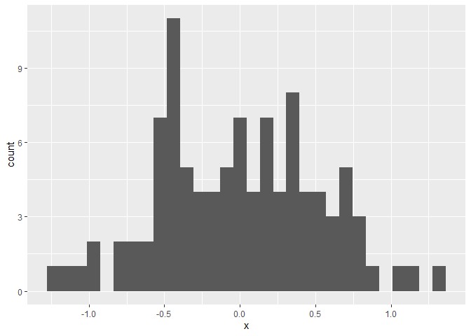
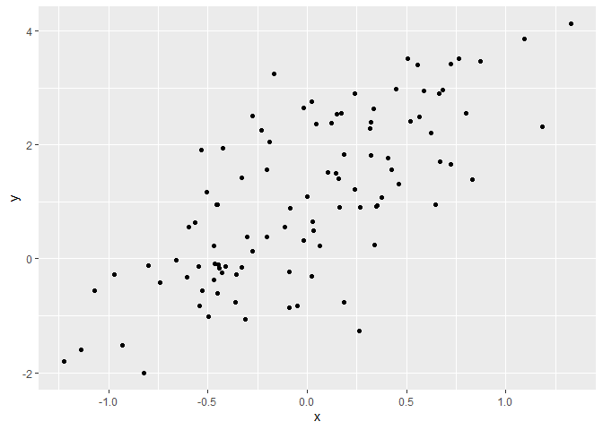
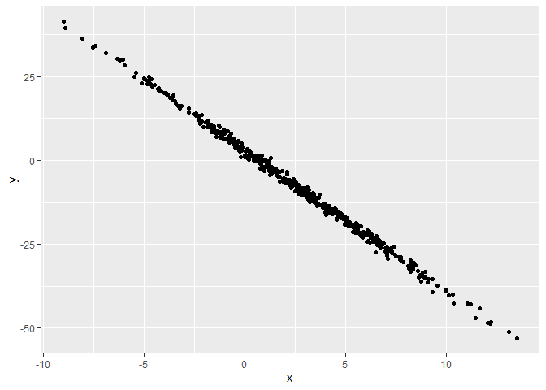

review_all
================
October 7th 2025

# What is Data Science?

I’m reviewing from the first week of classes to the 6th week of classes.
First, DEF: data science is the study of formulating and rigorously
answering questions using a data-centric process that emphasizes
clarity, reproducibility, effective communication, and ethical
practices.

From this lecture we learn how to load a package.

``` r
library(tidyverse)
```

    ## ── Attaching core tidyverse packages ──────────────────────── tidyverse 2.0.0 ──
    ## ✔ dplyr     1.1.4     ✔ readr     2.1.5
    ## ✔ forcats   1.0.0     ✔ stringr   1.5.1
    ## ✔ ggplot2   3.5.2     ✔ tibble    3.3.0
    ## ✔ lubridate 1.9.4     ✔ tidyr     1.3.1
    ## ✔ purrr     1.1.0     
    ## ── Conflicts ────────────────────────────────────────── tidyverse_conflicts() ──
    ## ✖ dplyr::filter() masks stats::filter()
    ## ✖ dplyr::lag()    masks stats::lag()
    ## ℹ Use the conflicted package (<http://conflicted.r-lib.org/>) to force all conflicts to become errors

Okay now we load a tidy example data set

``` r
library(p8105.datasets)
data("weather_df")
```

Using `help("weather_df")` we can have R tell us what is in the data.

Now here is an advanced visualization of this data using `ggplot`

``` r
weather_df |> 
  ggplot(aes(x = date, y = tmax, color = name)) +
  geom_point(alpha = .5) +
  geom_smooth(se = FALSE) +
  theme(legend.position = "bottom")
```

    ## `geom_smooth()` using method = 'loess' and formula = 'y ~ x'

    ## Warning: Removed 17 rows containing non-finite outside the scale range
    ## (`stat_smooth()`).

    ## Warning: Removed 17 rows containing missing values or values outside the scale range
    ## (`geom_point()`).

<!-- -->

# Best Practices

welcome to lecture 2, this should be okay.

``` r
library(tidyverse)
```

To save variables in R you must assign it to something

``` r
x = 2 + 3
y = c(1, 3, 5, 7)
```

now you can recall the variables for different things. Also `c()` means
a collection of numbers! So this code assigns variables.

``` r
x+y
```

    ## [1]  6  8 10 12

So now we will overwrite x, using a random number generation for x
amount of \#’s

``` r
x = runif(n = 20)
view(x)
```

to find info abt a code you might not know u can ask R

``` r
?runif
```

    ## starting httpd help server ... done

### Make a data frame

``` r
example_df = tibble(
  vec_numeric = 1:4,
  vec_char = c("my","name","is","yasmine"),
  vec_factor = factor(c("male", "male","female","female"))
)
```

so the `tibble` function helps us create the data frame table. using the
vec… we can fill in/ create out table.

if you don’t label the df, then you will have to code everything each
time.

Let’s plot

``` r
plot_df = tibble(
  x = rnorm(100, sd = .5),
  y = 1 +2 * x + rnorm(100)
)

ggplot(plot_df, aes(x = x)) + geom_histogram()
```

    ## `stat_bin()` using `bins = 30`. Pick better value with `binwidth`.

<!-- -->

``` r
ggplot(plot_df, aes(x = x, y = y)) + geom_point()
```

<!-- -->

Oh btw to save the plot we would do:

``` r
ggsave("scatter_plot_review.pdf", height = 4, width = 4)
```

# Writing with Data!

Restart R using session tab on top

I kind already know how to use r markdown documents bc im doing that rn
lol.

First know that using **, around your words make bold and \_ before and
after\_ makes: *this* vs the first one which is **this\*\*

### Making a data frame from plot

the code chunk below creates a data frame and generates a plot.

``` r
library(tidyverse)

plot2_df = tibble(
  x = rnorm(500, mean = 2, sd = 4),
  y = 3 - 4.2 * x + rnorm(500)
)

ggplot(plot2_df, aes(x = x, y = y)) + geom_point()
```

<!-- -->

Know that in editing the `{r}` section, you can make things disappear
from the final doc that is in our viewer.

using `echo = FALSE` you can hide the code you used to make the plot
using `message = FALSE` you turn off the messages so the study after you
load a package.

I will also code the data frame has 100rows. so using inline code `` and
putting in nrow(your_df_here), the R will code automatically for you the
number of rows.

#### Here is a list

using \* we can make lists:

- This is my first list item
- we need at least two items
  - using tab here is a sub item
- third list thang

#### Lets make a Table

| Col 1 | Col 2 |
|-------|-------|
| a     | b     |

> Now to make a block quote use this `>` and then type

Let’s see if I can do a quick learning assessment:

``` r
la_df = tibble(
  norm_samp = rnorm(500, mean = 1),
  norm_samp_pos = norm_samp > 0,
  abs_norm_samp = abs(norm_samp)
)

ggplot(la_df, aes(x = abs_norm_samp)) + geom_histogram()
```

    ## `stat_bin()` using `bins = 30`. Pick better value with `binwidth`.

<!-- -->

``` r
median_samp = median(pull(la_df, norm_samp))
```

Here you can find the median rounded 0.96.

Lets write a list of our previous sample *0.9672944 *0.9626831 \*
1.0013121

# Git and Github

Yay let’s start class 4. Luckily, I actually remember how to do most of
this as we are currently using git for this document. lol!

no need to review this information, we can now move onto the **HARD**
stuff.

say a *prayer*.
