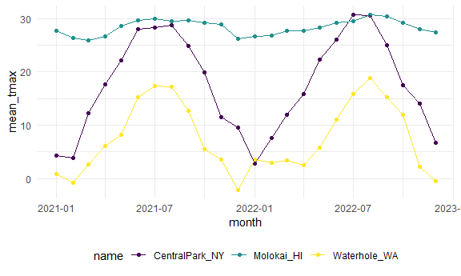
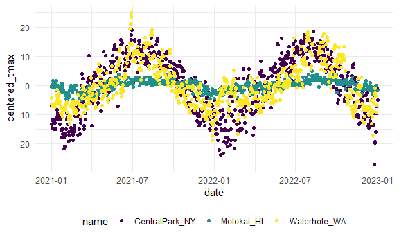

review_eda
================

``` r
library(tidyverse)
```

    ## ── Attaching core tidyverse packages ──────────────────────── tidyverse 2.0.0 ──
    ## ✔ dplyr     1.1.4     ✔ readr     2.1.5
    ## ✔ forcats   1.0.0     ✔ stringr   1.5.1
    ## ✔ ggplot2   3.5.2     ✔ tibble    3.3.0
    ## ✔ lubridate 1.9.4     ✔ tidyr     1.3.1
    ## ✔ purrr     1.1.0     
    ## ── Conflicts ────────────────────────────────────────── tidyverse_conflicts() ──
    ## ✖ dplyr::filter() masks stats::filter()
    ## ✖ dplyr::lag()    masks stats::lag()
    ## ℹ Use the conflicted package (<http://conflicted.r-lib.org/>) to force all conflicts to become errors

``` r
library(tidyverse)

knitr::opts_chunk$set(
  fig.width = 6,
  fig.asp = .6,
  out.width = "90%"
)

theme_set(theme_minimal() + theme(legend.position = "bottom"))

options(
  ggplot2.continuous.colour = "viridis",
  ggplot2.continuous.fill = "viridis"
)

scale_colour_discrete = scale_colour_viridis_d
scale_fill_discrete = scale_fill_viridis_d()
```

## Load weather data set

``` r
library(p8105.datasets)
data("weather_df")

weather_df = 
  weather_df |> 
  mutate(month = lubridate::floor_date(date, unit = "month"))
```

## `group_by`

``` r
weather_df |> 
  group_by(name, month) |> 
  ungroup()
```

    ## # A tibble: 2,190 × 7
    ##    name           id          date        prcp  tmax  tmin month     
    ##    <chr>          <chr>       <date>     <dbl> <dbl> <dbl> <date>    
    ##  1 CentralPark_NY USW00094728 2021-01-01   157   4.4   0.6 2021-01-01
    ##  2 CentralPark_NY USW00094728 2021-01-02    13  10.6   2.2 2021-01-01
    ##  3 CentralPark_NY USW00094728 2021-01-03    56   3.3   1.1 2021-01-01
    ##  4 CentralPark_NY USW00094728 2021-01-04     5   6.1   1.7 2021-01-01
    ##  5 CentralPark_NY USW00094728 2021-01-05     0   5.6   2.2 2021-01-01
    ##  6 CentralPark_NY USW00094728 2021-01-06     0   5     1.1 2021-01-01
    ##  7 CentralPark_NY USW00094728 2021-01-07     0   5    -1   2021-01-01
    ##  8 CentralPark_NY USW00094728 2021-01-08     0   2.8  -2.7 2021-01-01
    ##  9 CentralPark_NY USW00094728 2021-01-09     0   2.8  -4.3 2021-01-01
    ## 10 CentralPark_NY USW00094728 2021-01-10     0   5    -1.6 2021-01-01
    ## # ℹ 2,180 more rows

## counting

counting month and name observations

``` r
weather_df |> 
  group_by(name, month) |> 
  summarize(n_obs = n ())
```

    ## `summarise()` has grouped output by 'name'. You can override using the
    ## `.groups` argument.

    ## # A tibble: 72 × 3
    ## # Groups:   name [3]
    ##    name           month      n_obs
    ##    <chr>          <date>     <int>
    ##  1 CentralPark_NY 2021-01-01    31
    ##  2 CentralPark_NY 2021-02-01    28
    ##  3 CentralPark_NY 2021-03-01    31
    ##  4 CentralPark_NY 2021-04-01    30
    ##  5 CentralPark_NY 2021-05-01    31
    ##  6 CentralPark_NY 2021-06-01    30
    ##  7 CentralPark_NY 2021-07-01    31
    ##  8 CentralPark_NY 2021-08-01    31
    ##  9 CentralPark_NY 2021-09-01    30
    ## 10 CentralPark_NY 2021-10-01    31
    ## # ℹ 62 more rows

we can use `count`

``` r
weather_df |> 
  count(name, month, name = "n_obs")
```

    ## # A tibble: 72 × 3
    ##    name           month      n_obs
    ##    <chr>          <date>     <int>
    ##  1 CentralPark_NY 2021-01-01    31
    ##  2 CentralPark_NY 2021-02-01    28
    ##  3 CentralPark_NY 2021-03-01    31
    ##  4 CentralPark_NY 2021-04-01    30
    ##  5 CentralPark_NY 2021-05-01    31
    ##  6 CentralPark_NY 2021-06-01    30
    ##  7 CentralPark_NY 2021-07-01    31
    ##  8 CentralPark_NY 2021-08-01    31
    ##  9 CentralPark_NY 2021-09-01    30
    ## 10 CentralPark_NY 2021-10-01    31
    ## # ℹ 62 more rows

**never** use base R’s `table`

other helpful counters

``` r
weather_df |> 
  group_by(month) |> 
  summarize(n_obs = n(),
            n_days = n_distinct(date))
```

    ## # A tibble: 24 × 3
    ##    month      n_obs n_days
    ##    <date>     <int>  <int>
    ##  1 2021-01-01    93     31
    ##  2 2021-02-01    84     28
    ##  3 2021-03-01    93     31
    ##  4 2021-04-01    90     30
    ##  5 2021-05-01    93     31
    ##  6 2021-06-01    90     30
    ##  7 2021-07-01    93     31
    ##  8 2021-08-01    93     31
    ##  9 2021-09-01    90     30
    ## 10 2021-10-01    93     31
    ## # ℹ 14 more rows

## A digression on 2x2 tables

``` r
weather_df |> 
  filter(name != "Molokai_HI") |> 
  mutate(
    cold = case_when(
      tmax < 5 ~ "cold",
      tmax >= 5 ~ "not cold",
      TRUE    ~ ""
    )
  ) |> 
  janitor::tabyl(name, cold)
```

    ##            name cold not cold emptystring_
    ##  CentralPark_NY   96      634            0
    ##    Waterhole_WA  319      395           16

## General summares

YOU can do lots of summaries

``` r
weather_df |> 
  group_by(month) |> 
  summarize(
    mean_tmax = mean(tmax, na.rm = TRUE),
    mean_prcp = mean(prcp, na.rm = TRUE),
    median_tmin = median(tmin, na.rm = TRUE)
  )
```

    ## # A tibble: 24 × 4
    ##    month      mean_tmax mean_prcp median_tmin
    ##    <date>         <dbl>     <dbl>       <dbl>
    ##  1 2021-01-01     10.9       39.5        0.6 
    ##  2 2021-02-01      9.82      42.6       -1.65
    ##  3 2021-03-01     13.7       55.5        5   
    ##  4 2021-04-01     16.8       14.7        8.05
    ##  5 2021-05-01     19.6       17.3       11.1 
    ##  6 2021-06-01     24.3       14.1       17.8 
    ##  7 2021-07-01     25.2       30.7       21.1 
    ##  8 2021-08-01     25.2       30.6       21.1 
    ##  9 2021-09-01     22.4       35.4       17.5 
    ## 10 2021-10-01     18.2       36.0       13.9 
    ## # ℹ 14 more rows

this is a dataframe! so we can make a plot

``` r
weather_df |> 
  group_by(name, month) |> 
  summarize(
    mean_tmax = mean(tmax, na.rm = TRUE),
    mean_prcp = mean(prcp, na.rm = TRUE),
    median_tmin = median(tmin, na.rm = TRUE)
  ) |> 
  ggplot(aes(x = month, y = mean_tmax, color = name)) +
  geom_point() + 
  geom_line()
```

    ## `summarise()` has grouped output by 'name'. You can override using the
    ## `.groups` argument.



Suppose you want to summarize many columns.

``` r
weather_df |> 
  group_by(name, month) |> 
  summarize(across(prcp:tmin, mean))
```

    ## `summarise()` has grouped output by 'name'. You can override using the
    ## `.groups` argument.

    ## # A tibble: 72 × 5
    ## # Groups:   name [3]
    ##    name           month       prcp  tmax  tmin
    ##    <chr>          <date>     <dbl> <dbl> <dbl>
    ##  1 CentralPark_NY 2021-01-01  18.9  4.27 -1.15
    ##  2 CentralPark_NY 2021-02-01  46.6  3.87 -1.39
    ##  3 CentralPark_NY 2021-03-01  28.0 12.3   3.1 
    ##  4 CentralPark_NY 2021-04-01  22.8 17.6   7.48
    ##  5 CentralPark_NY 2021-05-01  35.7 22.1  12.2 
    ##  6 CentralPark_NY 2021-06-01  22.2 28.1  18.9 
    ##  7 CentralPark_NY 2021-07-01  90.9 28.4  20.6 
    ##  8 CentralPark_NY 2021-08-01  84.5 28.8  21.8 
    ##  9 CentralPark_NY 2021-09-01  84.9 24.8  17.8 
    ## 10 CentralPark_NY 2021-10-01  43.1 19.9  13.4 
    ## # ℹ 62 more rows

Reminder: sometimes your results are easier to read in another format

``` r
weather_df |> 
  group_by(name, month) |> 
  summarize(mean_tmax = mean(tmax)) |> 
  pivot_wider(
    names_from = name,
    values_from = mean_tmax,
  ) |> 
  knitr::kable(digits = 1)
```

    ## `summarise()` has grouped output by 'name'. You can override using the
    ## `.groups` argument.

| month      | CentralPark_NY | Molokai_HI | Waterhole_WA |
|:-----------|---------------:|-----------:|-------------:|
| 2021-01-01 |            4.3 |       27.6 |          0.8 |
| 2021-02-01 |            3.9 |       26.4 |         -0.8 |
| 2021-03-01 |           12.3 |       25.9 |           NA |
| 2021-04-01 |           17.6 |       26.6 |          6.1 |
| 2021-05-01 |           22.1 |       28.6 |          8.2 |
| 2021-06-01 |           28.1 |       29.6 |         15.3 |
| 2021-07-01 |           28.4 |       30.0 |         17.3 |
| 2021-08-01 |           28.8 |       29.5 |         17.2 |
| 2021-09-01 |           24.8 |       29.7 |         12.6 |
| 2021-10-01 |           19.9 |       29.1 |          5.5 |
| 2021-11-01 |           11.5 |       28.8 |          3.5 |
| 2021-12-01 |            9.6 |       26.2 |           NA |
| 2022-01-01 |            2.9 |       26.6 |          3.6 |
| 2022-02-01 |            7.7 |       26.8 |           NA |
| 2022-03-01 |           12.0 |       27.7 |          3.4 |
| 2022-04-01 |           15.8 |       27.7 |          2.5 |
| 2022-05-01 |           22.3 |         NA |          5.8 |
| 2022-06-01 |           26.1 |       29.2 |         11.1 |
| 2022-07-01 |           30.7 |       29.5 |         15.9 |
| 2022-08-01 |           30.5 |       30.7 |           NA |
| 2022-09-01 |           24.9 |       30.4 |         15.2 |
| 2022-10-01 |           17.4 |       29.2 |         11.9 |
| 2022-11-01 |           14.0 |       28.0 |          2.1 |
| 2022-12-01 |            6.8 |       27.3 |           NA |

## `group_by` and `mutate`

``` r
weather_df |> 
  group_by(name) |> 
  mutate(
    mean_tmax = mean(tmax, na.rm = TRUE),
    centered_tmax = tmax - mean_tmax
  ) |> 
  ggplot(aes(x = date, y = centered_tmax, color = name)) +
  geom_point()
```

    ## Warning: Removed 17 rows containing missing values or values outside the scale range
    ## (`geom_point()`).



what about window functions ranking..

``` r
weather_df |> 
  group_by(name, month) |> 
  mutate(temp_rank = min_rank(tmax))
```

    ## # A tibble: 2,190 × 8
    ## # Groups:   name, month [72]
    ##    name           id          date        prcp  tmax  tmin month      temp_rank
    ##    <chr>          <chr>       <date>     <dbl> <dbl> <dbl> <date>         <int>
    ##  1 CentralPark_NY USW00094728 2021-01-01   157   4.4   0.6 2021-01-01        14
    ##  2 CentralPark_NY USW00094728 2021-01-02    13  10.6   2.2 2021-01-01        31
    ##  3 CentralPark_NY USW00094728 2021-01-03    56   3.3   1.1 2021-01-01        13
    ##  4 CentralPark_NY USW00094728 2021-01-04     5   6.1   1.7 2021-01-01        20
    ##  5 CentralPark_NY USW00094728 2021-01-05     0   5.6   2.2 2021-01-01        19
    ##  6 CentralPark_NY USW00094728 2021-01-06     0   5     1.1 2021-01-01        16
    ##  7 CentralPark_NY USW00094728 2021-01-07     0   5    -1   2021-01-01        16
    ##  8 CentralPark_NY USW00094728 2021-01-08     0   2.8  -2.7 2021-01-01         8
    ##  9 CentralPark_NY USW00094728 2021-01-09     0   2.8  -4.3 2021-01-01         8
    ## 10 CentralPark_NY USW00094728 2021-01-10     0   5    -1.6 2021-01-01        16
    ## # ℹ 2,180 more rows

lag

``` r
weather_df |> 
  group_by(name) |> 
  mutate(temp_change = tmax -lag(tmax)) |> 
  summarize(
    temp_change_max = max(temp_change, na.rm = TRUE),
    temp_change_sd = sd(temp_change, na.rm = TRUE)
  )
```

    ## # A tibble: 3 × 3
    ##   name           temp_change_max temp_change_sd
    ##   <chr>                    <dbl>          <dbl>
    ## 1 CentralPark_NY            12.2           4.43
    ## 2 Molokai_HI                 5.6           1.24
    ## 3 Waterhole_WA              11.1           3.04
