review_viz2
================

``` r
library(tidyverse)
```

    ## ── Attaching core tidyverse packages ──────────────────────── tidyverse 2.0.0 ──
    ## ✔ dplyr     1.1.4     ✔ readr     2.1.5
    ## ✔ forcats   1.0.0     ✔ stringr   1.5.1
    ## ✔ ggplot2   3.5.2     ✔ tibble    3.3.0
    ## ✔ lubridate 1.9.4     ✔ tidyr     1.3.1
    ## ✔ purrr     1.1.0     
    ## ── Conflicts ────────────────────────────────────────── tidyverse_conflicts() ──
    ## ✖ dplyr::filter() masks stats::filter()
    ## ✖ dplyr::lag()    masks stats::lag()
    ## ℹ Use the conflicted package (<http://conflicted.r-lib.org/>) to force all conflicts to become errors

``` r
library(patchwork)
```

``` r
library(p8105.datasets)
data("weather_df")

weather_df
```

    ## # A tibble: 2,190 × 6
    ##    name           id          date        prcp  tmax  tmin
    ##    <chr>          <chr>       <date>     <dbl> <dbl> <dbl>
    ##  1 CentralPark_NY USW00094728 2021-01-01   157   4.4   0.6
    ##  2 CentralPark_NY USW00094728 2021-01-02    13  10.6   2.2
    ##  3 CentralPark_NY USW00094728 2021-01-03    56   3.3   1.1
    ##  4 CentralPark_NY USW00094728 2021-01-04     5   6.1   1.7
    ##  5 CentralPark_NY USW00094728 2021-01-05     0   5.6   2.2
    ##  6 CentralPark_NY USW00094728 2021-01-06     0   5     1.1
    ##  7 CentralPark_NY USW00094728 2021-01-07     0   5    -1  
    ##  8 CentralPark_NY USW00094728 2021-01-08     0   2.8  -2.7
    ##  9 CentralPark_NY USW00094728 2021-01-09     0   2.8  -4.3
    ## 10 CentralPark_NY USW00094728 2021-01-10     0   5    -1.6
    ## # ℹ 2,180 more rows

Remeber this plot?

``` r
weather_df |> 
  ggplot(aes(x = tmin, y = tmax, color = name)) +
  geom_point(alpha = 0.5)
```

    ## Warning: Removed 17 rows containing missing values or values outside the scale range
    ## (`geom_point()`).

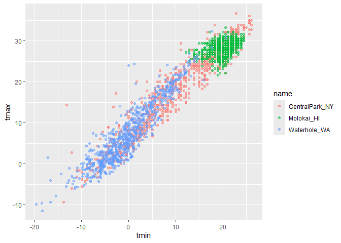<!-- -->

## Labels

``` r
weather_df |> 
  ggplot(aes(x = tmin, y = tmax, color = name)) +
  geom_point(alpha = 0.5) +
  labs(
    title = " Temperature plot",
    x = "minimum daily temperature (C)",
    y = "maximum daily temperature (C)",
    caption = "Data from rnoaa package; temperatures in 2017"
  )
```

    ## Warning: Removed 17 rows containing missing values or values outside the scale range
    ## (`geom_point()`).

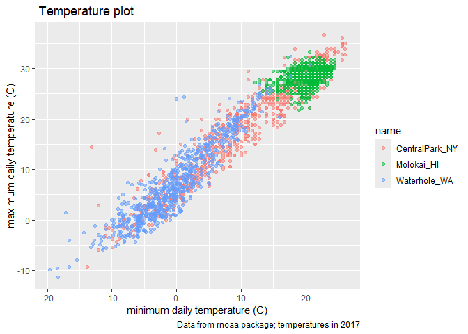<!-- -->

## Scales

Star with the same plot

``` r
weather_df |> 
  ggplot(aes(x = tmin, y = tmax, color = name)) +
  geom_point(alpha = 0.5) +
  labs(
    title = " Temperature plot",
    x = "minimum daily temperature (C)",
    y = "maximum daily temperature (C)",
    caption = "Data from rnoaa package; temperatures in 2017"
  ) +
  scale_x_continuous(
    breaks = c(-15, 0, 15),
    labels = c("-15 C", "0", "15")
  ) + 
  scale_y_continuous(
    position = "right"
  )
```

    ## Warning: Removed 17 rows containing missing values or values outside the scale range
    ## (`geom_point()`).

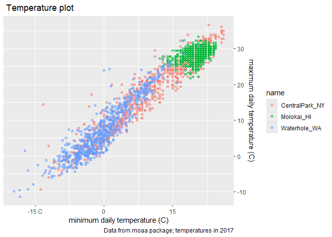<!-- -->

Look at color scales

``` r
weather_df |> 
  ggplot(aes(x = tmin, y = tmax, color = name)) +
  geom_point(alpha = 0.5) +
  labs(
    title = " Temperature plot",
    x = "minimum daily temperature (C)",
    y = "maximum daily temperature (C)",
    caption = "Data from rnoaa package; temperatures in 2017"
  ) +
  scale_color_hue(
    name = "Location",
    h = c(100, 300))
```

    ## Warning: Removed 17 rows containing missing values or values outside the scale range
    ## (`geom_point()`).

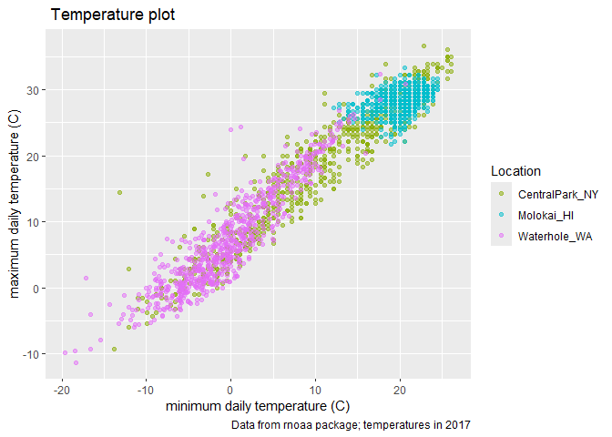<!-- -->

lets try something different

``` r
weather_df |> 
  ggplot(aes(x = tmin, y = tmax, color = name)) +
  geom_point(alpha = 0.5) +
  labs(
    title = " Temperature plot",
    x = "minimum daily temperature (C)",
    y = "maximum daily temperature (C)",
    caption = "Data from rnoaa package; temperatures in 2017"
  ) +
  viridis::scale_color_viridis(
    name = "location",
    discrete = TRUE
  )
```

    ## Warning: Removed 17 rows containing missing values or values outside the scale range
    ## (`geom_point()`).

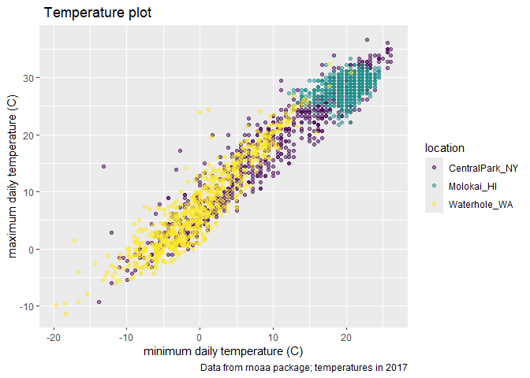<!-- -->

## Themes

shift the legend

``` r
weather_df |> 
  ggplot(aes(x = tmin, y = tmax, color = name)) +
  geom_point(alpha = 0.5) +
  labs(
    title = " Temperature plot",
    x = "minimum daily temperature (C)",
    y = "maximum daily temperature (C)",
    caption = "Data from rnoaa package; temperatures in 2017"
  ) +
  viridis::scale_color_viridis(
    name = "location",
    discrete = TRUE) +
  theme(legend.position = "bottom")
```

    ## Warning: Removed 17 rows containing missing values or values outside the scale range
    ## (`geom_point()`).

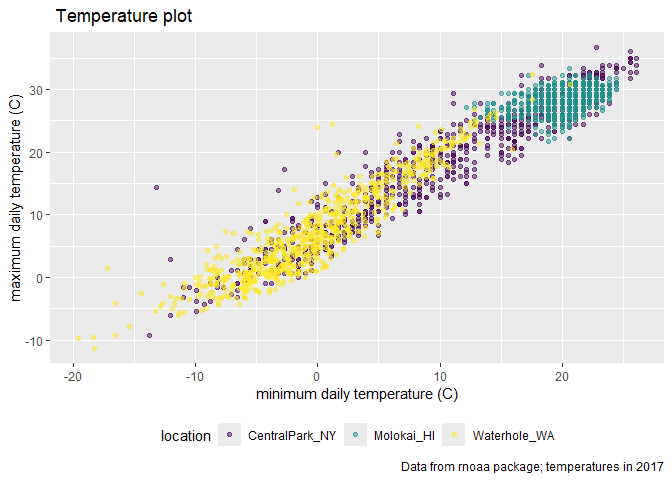<!-- -->

change the overall features

``` r
weather_df |> 
  ggplot(aes(x = tmin, y = tmax, color = name)) +
  geom_point(alpha = 0.5) +
  labs(
    title = " Temperature plot",
    x = "minimum daily temperature (C)",
    y = "maximum daily temperature (C)",
    caption = "Data from rnoaa package; temperatures in 2017"
  ) +
  viridis::scale_color_viridis(
    name = "location",
    discrete = TRUE) +
  theme_minimal() +
  theme(legend.position = "bottom")
```

    ## Warning: Removed 17 rows containing missing values or values outside the scale range
    ## (`geom_point()`).

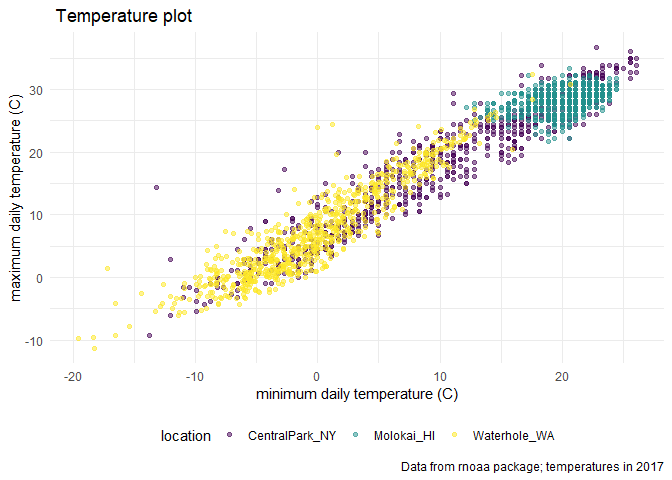<!-- -->

must put theme_minimal FIRST

## Setting options

he does this before he starts

``` r
library(tidyverse)

knitr::opts_chunk$set(
  fig.width = 6,
  fig.asp = .6,
  out.width = "90%"
)

theme_set(theme_minimal() + theme(legend.position = "bottom"))

options(
  ggplot2.continuous.colour = "viridis",
  ggplot2.continuous.fill = "viridis"
)

scale_colour_discrete = scale_colour_viridis_d
scale_fill_discrete = scale_fill_viridis_d()
```

## Data args in `geom`

``` r
central_park =
  weather_df |> 
  filter(name == "CentralPark_NY")

molokai =
  weather_df |> 
  filter(name == "Molokai_HI")

ggplot(data = molokai, aes(x = date, y = tmax, color = name)) +
  geom_point() +
  geom_line(data = central_park)
```

    ## Warning: Removed 1 row containing missing values or values outside the scale range
    ## (`geom_point()`).

<!-- -->

## `patchwork`

``` r
weather_df |>  
  ggplot(aes(x = tmin, fill = name)) +
  geom_density(alpha = .5) +
  facet_grid(. ~ name)
```

    ## Warning: Removed 17 rows containing non-finite outside the scale range
    ## (`stat_density()`).

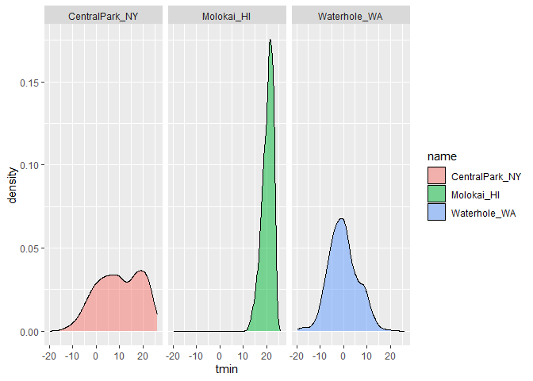<!-- -->

what happens when you want multipanel plots but can’t facet?

``` r
tmax_tmin_p =
weather_df |> 
  ggplot(aes(x = tmin, y = tmax, color = name)) +
  geom_point(alpha = 0.5) +
  theme(legend.position = "none")

prcp_dens_p =
  weather_df |>
  filter(prcp > 0) |> 
  ggplot(aes(x = prcp, fill = name)) +
  geom_density(alpha = 0.5) +
  theme(legend.position = "none")

tmax_date_p =
  weather_df |> 
  ggplot(aes(x = date, y = tmax, color = name)) +
  geom_point() +
  geom_smooth(se = FALSE) +
  theme(legend.position = "none")

(tmax_tmin_p + prcp_dens_p) / tmax_date_p
```

    ## Warning: Removed 17 rows containing missing values or values outside the scale range
    ## (`geom_point()`).

    ## `geom_smooth()` using method = 'loess' and formula = 'y ~ x'

    ## Warning: Removed 17 rows containing non-finite outside the scale range
    ## (`stat_smooth()`).
    ## Removed 17 rows containing missing values or values outside the scale range
    ## (`geom_point()`).

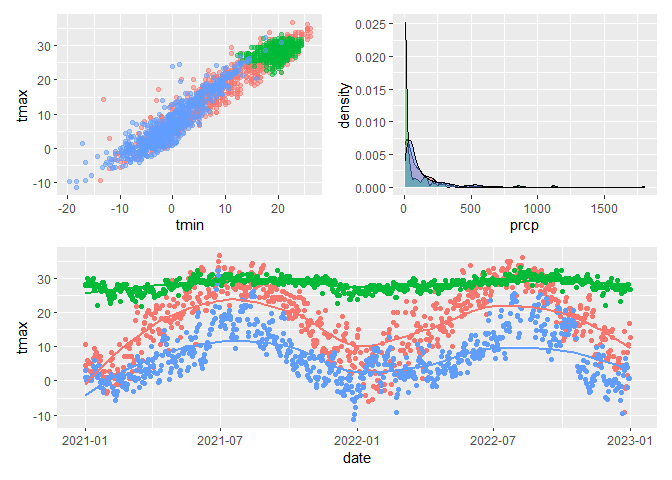<!-- -->

## Data manipulation

control your factors

``` r
weather_df |> 
  mutate(
    name = factor(name),
    name = forcats::fct_relevel(name, c("Molokai_HI"))
  ) |> 
  ggplot(aes(x = name, y = tmax, fill = name)) +
  geom_violin(alpha = .5)
```

    ## Warning: Removed 17 rows containing non-finite outside the scale range
    ## (`stat_ydensity()`).

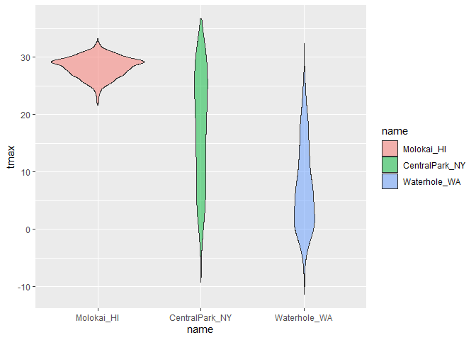<!-- -->

what if i wanted densities for tmin and tmax simultaneously?

``` r
weather_df |> 
  pivot_longer(
    tmax:tmin,
    names_to = "observation",
    values_to = "temperatures"
  ) |> 
  ggplot(aes(x = temperatures, fill = observation)) +
  geom_density(alpha = .5) +
  facet_grid(. ~ name)
```

    ## Warning: Removed 34 rows containing non-finite outside the scale range
    ## (`stat_density()`).

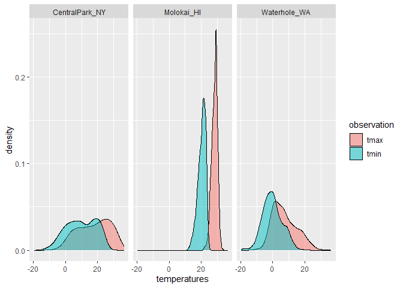<!-- -->
