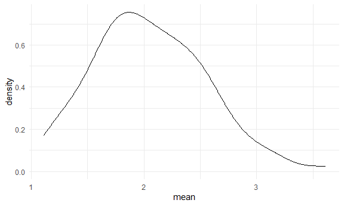
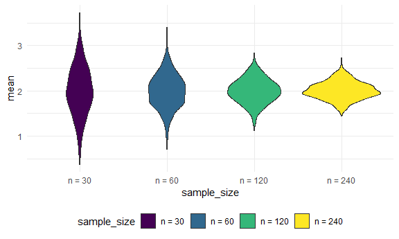
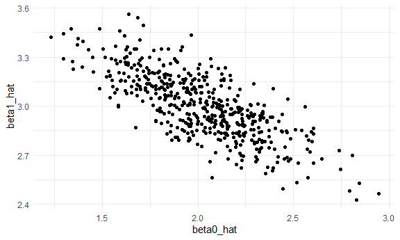

simulation
================

``` r
library(tidyverse)
```

    ## ── Attaching core tidyverse packages ──────────────────────── tidyverse 2.0.0 ──
    ## ✔ dplyr     1.1.4     ✔ readr     2.1.5
    ## ✔ forcats   1.0.0     ✔ stringr   1.5.1
    ## ✔ ggplot2   3.5.2     ✔ tibble    3.3.0
    ## ✔ lubridate 1.9.4     ✔ tidyr     1.3.1
    ## ✔ purrr     1.1.0     
    ## ── Conflicts ────────────────────────────────────────── tidyverse_conflicts() ──
    ## ✖ dplyr::filter() masks stats::filter()
    ## ✖ dplyr::lag()    masks stats::lag()
    ## ℹ Use the conflicted package (<http://conflicted.r-lib.org/>) to force all conflicts to become errors

``` r
library(rvest)
```

    ## 
    ## Attaching package: 'rvest'
    ## 
    ## The following object is masked from 'package:readr':
    ## 
    ##     guess_encoding

``` r
knitr::opts_chunk$set(
  fig.width = 6,
  fig.asp = .6 ,
  out.width = "90%"
)

theme_set(theme_minimal() + theme(legend.position = "bottom"))

options(
  ggplot2.continuous.colour = "viridis",
  ggplot2.continuous.fill = "virids"
)

scale_colour_discrete = scale_color_viridis_d
scale_fill_discrete = scale_fill_viridis_d
```

## let’s simulate something

I have a function

``` r
sim_mean_sd = function(n, mu = 2, sigma = 3) {
  
  sim_data = tibble(
    x = rnorm(n, mean = mu, sd = sigma),
  )
  
  sim_data |> 
    summarize(
      mean = mean(x),
      sd = sd(x)
    )
}
```

I can “simulate” by running this line.

``` r
sim_mean_sd(30)
```

    ## # A tibble: 1 × 2
    ##    mean    sd
    ##   <dbl> <dbl>
    ## 1  2.43  2.16

## Let’s simulate alot

Let’s start with a for loop

``` r
output = vector("list", 100)

for (i in 1:100) {
  
  output[[i]] = sim_mean_sd(30)
}

bind_rows(output)
```

    ## # A tibble: 100 × 2
    ##     mean    sd
    ##    <dbl> <dbl>
    ##  1  1.60  3.03
    ##  2  2.10  3.10
    ##  3  1.95  2.95
    ##  4  2.05  2.91
    ##  5  1.56  3.01
    ##  6  2.71  2.42
    ##  7  1.46  3.63
    ##  8  1.36  3.50
    ##  9  1.58  3.24
    ## 10  1.45  2.58
    ## # ℹ 90 more rows

Let’s use a loop function.

``` r
sim_results =
  rerun(100, sim_mean_sd(30)) |> 
  bind_rows()
```

    ## Warning: `rerun()` was deprecated in purrr 1.0.0.
    ## ℹ Please use `map()` instead.
    ##   # Previously
    ##   rerun(100, sim_mean_sd(30))
    ## 
    ##   # Now
    ##   map(1:100, ~ sim_mean_sd(30))
    ## This warning is displayed once every 8 hours.
    ## Call `lifecycle::last_lifecycle_warnings()` to see where this warning was
    ## generated.

Let’s look at results…

``` r
sim_results |> 
  ggplot(aes(x = mean)) + geom_density()
```



``` r
sim_results |> 
  summarize(
    avg_samp_mean = mean(mean),
    sd_samp_mean = sd(mean)
  )
```

    ## # A tibble: 1 × 2
    ##   avg_samp_mean sd_samp_mean
    ##           <dbl>        <dbl>
    ## 1          2.12        0.536

## Let’s try other sample sizes.

``` r
sim_results |> 
  pivot_longer(
    mean:sd,
    names_to = "parameter", 
    values_to = "estimate") |> 
  group_by(parameter) |> 
  summarize(
    emp_mean = mean(estimate),
    emp_sd = sd(estimate)) |> 
  knitr::kable(digits = 3)
```

| parameter | emp_mean | emp_sd |
|:----------|---------:|-------:|
| mean      |    2.118 |  0.536 |
| sd        |    2.984 |  0.391 |

short hand run:

``` r
sim_results_df =   
  map(1:100, \(i) sim_mean_sd(30, 2, 3)) |> 
  bind_rows()
```

simulation: mean for several n’s

``` r
sim_results_df = 
  expand_grid(
    sample_size = c(30, 60, 120, 240),
    iter = 1:1000
  ) |> 
  mutate(
    estimate_df = map(sample_size, sim_mean_sd)
  ) |> 
  unnest(estimate_df)
```

look at mean estimates across sample sizes

``` r
sim_results_df |> 
  mutate(
    sample_size = str_c("n = ", sample_size),
    sample_size = fct_inorder(sample_size)) |> 
  ggplot(aes(x = sample_size, y = mean, fill = sample_size)) + 
  geom_violin()
```



as the sample size grows, the width of the distribution shrinks.

Look at empirical mean and variance.

``` r
sim_results_df |> 
  pivot_longer(
    mean:sd,
    names_to = "parameter", 
    values_to = "estimate") |> 
  group_by(parameter, sample_size) |> 
  summarize(
    emp_mean = mean(estimate),
    emp_var = var(estimate)) |> 
  knitr::kable(digits = 3)
```

    ## `summarise()` has grouped output by 'parameter'. You can override using the
    ## `.groups` argument.

| parameter | sample_size | emp_mean | emp_var |
|:----------|------------:|---------:|--------:|
| mean      |          30 |    1.995 |   0.305 |
| mean      |          60 |    1.988 |   0.141 |
| mean      |         120 |    1.996 |   0.073 |
| mean      |         240 |    2.007 |   0.039 |
| sd        |          30 |    2.945 |   0.161 |
| sd        |          60 |    2.984 |   0.075 |
| sd        |         120 |    2.989 |   0.040 |
| sd        |         240 |    2.992 |   0.020 |

## Simulation for one n

creating a function:

``` r
sim_regression = function(n, beta0 = 2, beta1 = 3) {
  
  sim_data = 
    tibble(
      x = rnorm(n, mean = 1, sd = 1),
      y = beta0 + beta1 * x + rnorm(n, 0, 1)
    )
  
  ls_fit = lm(y ~ x, data = sim_data)
  
  tibble(
    beta0_hat = coef(ls_fit)[1],
    beta1_hat = coef(ls_fit)[2]
  )
}
```

run it 500 times:

``` r
sim_results = 
  expand_grid(
    sample_size = 30,
    iter = 1:500
  ) |> 
  mutate(
    estimate_df = map(sample_size, sim_regression)
  ) |> 
  unnest(estimate_df)
```

now we plot this:

``` r
sim_results |> 
  ggplot(aes(x = beta0_hat, y = beta1_hat)) + 
  geom_point()
```



in the p8105.com we do one more example where we learn that: For both
true SDs, increasing the sample size results in a narrower distribution,
and the distribution of the sample mean is wider when the true SD is
larger.
